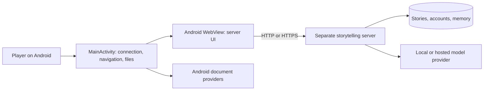

# Architecture and implementation

[Documentation index](../README.md#documentation)

## System boundary

The repository builds a small, first-party Java client using platform Android APIs. The main screen is the server's application rendered by Android WebView. Native code manages device interaction and connection boundaries. The server owns authentication, stories, sessions, memory, models, media processing, and the application API.

The client does not embed the server frontend as a static bundle. It loads the configured origin and therefore receives web UI changes from the server. APK changes are needed for native code and resources. Custom server certificate choices are saved on the device.

## Main source files

| File | Responsibility |
| --- | --- |
| `app/src/main/java/io/github/haywoodspartan/yumina/android/MainActivity.java` | Activity UI, WebView setup, navigation, options, error recovery, file selection, exports, and lifecycle |
| `app/src/main/java/io/github/haywoodspartan/yumina/android/ServerAddress.java` | Pure-Java URL validation, origin comparison, Blob origin checks, native options command checks |
| `app/src/main/AndroidManifest.xml` | Launcher activity, Internet permission, app label/icons, backup policy, resize/configuration behavior |
| `app/src/main/res/xml/network_security_config.xml` | HTTP allowance and HTTPS trust-anchor sources |
| `app/src/main/java/io/github/haywoodspartan/yumina/android/CertificateTrust.java` | HTTPS-origin keys, SHA-256 identity, public-certificate decoding, and scoped download verification |
| `app/src/main/res/values/styles.xml` | Native Android theme/colors |
| `tests/ServerAddressTest.java` | Host/port/scheme and origin boundary regressions |
| `tests/CertificateTrustTest.java` | Real temporary certificates for trust isolation, expiry, identity and download-verifier checks |
| `build.py` | Portable compilation, signing, verification and output publication |
| `tools/SignApk.java` | Build-time APK signing and signature verification |

The native UI is constructed programmatically. There is no Compose, Flutter, React Native, AndroidX UI stack, bundled local LLM, or native-library dependency in this implementation.

## Activity initialization

`onCreate` loads the saved origin from the private `connection` SharedPreferences file and normalizes it again. An invalid stored value becomes an empty connection. The method creates the root layout, progress bar, content area, WebView, fallback options button, and recovery panel.

On a new connection it loads the origin. During supported activity restoration it can restore WebView state when the saved origin still matches. The activity preserves the origin in saved-instance state and delegates page history restoration to WebView.

System insets are applied to keep interactive content outside system bars, display cutouts, and the keyboard. Android 13+ also uses the platform back-invoked callback.

## Connection state and stale callbacks

`connected` identifies a completed same-origin page load without a recorded failure. `pageFailed` marks the current failed page. `destroyed` stops callbacks after activity teardown. `saving` permits only one native export at a time.

The integer `navigation` changes with page navigation and renderer replacement. Asynchronous handlers capture its current value and check it before acting. This prevents an old timer, Blob result, or UI probe from being applied to a newer page.

The client treats the native recovery panel as an independent path: it does not rely on the unreachable server to render an error message or connection menu.

## WebView configuration

JavaScript and DOM storage are enabled because the server interface needs them. First-party cookies are enabled; third-party cookies are disabled for the WebView. Content access permits explicit document-provider uploads. File access and file-URL escalation flags are disabled.

Mixed content is set to `MIXED_CONTENT_NEVER_ALLOW`. Multiple windows and automatic script-opened windows are disabled. Media playback requires a user gesture. Safe Browsing is requested through the platform setting, subject to the installed WebView provider's support.

The user agent adds `YuminaAndroid/1.4.0`. The associated server can detect the app and avoid offering redundant APK download links. This identifier also communicates native compatibility/version information.

There is no `addJavascriptInterface` bridge. The limited integration uses navigation checks and native-initiated `evaluateJavascript` calls.

## Page loading and recovery

`onPageStarted` marks the page as loading, advances the navigation counter, clears connected state, and hides the fallback options button. A main-page load outside the configured origin is stopped. A 30-second timer can stop an unresolved load and display the native timeout message; it checks the current WebView and navigation counter first.

`onPageFinished` hides progress, flushes cookies, and marks a successful same-origin page connected. It probes the page's `data-android-app-options` attribute to decide whether to show the legacy native overflow button.

Main-frame network errors and HTTP errors use the native panel. HTTPS errors are cancelled unless the only reported error is an unknown issuer and the valid presented leaf exactly matches a certificate already accepted for this HTTPS origin. A new or changed certificate is cancelled first and shown for fingerprint review; a confirmed choice is saved before a fresh connection. Date, hostname, and other errors cannot be overridden. A renderer failure destroys and replaces the old WebView, then presents Retry.

`replaceWebView` also clears pending upload callbacks and starts a new history. This is used when changing the server, clearing login/cache, and recovering from renderer loss.

## Navigation decisions

Same-origin URLs remain in the WebView. The origin consists of scheme, host, and effective port, with 80/443 used when no port is present. Comparison ignores case for scheme/host and refuses URL user-info.

The exact `yumina-app://options` command opens the native menu only when it comes from a same-origin current page, is a main-frame navigation, has a user gesture, and is not a redirect. The command does not accept additional paths, parameters, or alternate actions.

External main-frame `http`, `https`, and `mailto` links use Android `ACTION_VIEW`. Unsupported schemes are rejected with a message. Same-origin Blob navigation is accepted only in the explicit current-page navigation case; Blob saving is independently origin checked.

## Document uploads

`onShowFileChooser` accepts a request only from the current connected same-origin page. It cancels a previous pending chooser callback and creates an `ACTION_OPEN_DOCUMENT` intent with `CATEGORY_OPENABLE`.

The chooser maps accepted extensions/MIME types from the web control and permits multiple selection when requested. `onActivityResult` returns up to 200 `content://` items to the active callback, or null for cancellation/invalid results. The app does not expose the phone's unrestricted filesystem to the page.

## Export pipeline

The WebView download listener enters `startDownload`. It refuses exports while disconnected, while another export is in progress, or when the current page is not on the configured origin.

For an ordinary same-origin URL, the client records the URL and current cookie header before opening an `ACTION_CREATE_DOCUMENT` picker. A single-thread executor writes into the chosen destination. HTTP redirects are followed manually and each next URL is origin-checked before cookies are sent. HTTPS downloads use the normal platform trust manager with a fallback for the exact valid leaf accepted for that origin. The default hostname verifier remains enabled. Connect/read timeouts are 15/30 seconds; the loop permits up to six request attempts.

For a same-origin Blob URL, native-initiated JavaScript fetches the Blob from the current page, checks the 10 MiB limit, and uses FileReader to produce a data URL. Native code polls the temporary page object at 100 ms intervals, with a bounded retry count and navigation checks. It decodes the bytes and then opens the save picker. If an HTML anchor supplies a `download` filename, the client preserves it.

Filename separators and line breaks are replaced before opening the picker. Writes run off the UI thread. A success toast occurs only after stream closure succeeds. Failure does not automatically delete a document partially created by the chosen provider.

## Lifecycle and back behavior

On pause, cookies are flushed and WebView is paused. On resume, WebView resumes. On destroy, callbacks are removed, pending chooser callbacks are cancelled, the WebView is destroyed, and the transfer executor is shut down.

Back handling asks the compatible page's `window.yuminaAndroidBack()` hook to process the action first. If the hook is absent or does not return JavaScript boolean `true`, the client uses WebView history or finishes the activity. The asynchronous result must match the current navigation counter.

Activity restoration is best-effort. It is not an offline copy of the conversation, and the native client provides no inference foreground service or notification service. Resuming server generation is a responsibility of the compatible server UI.

## Build architecture

The portable pipeline uses a pinned Windows x64 toolchain rather than relying on an installed SDK. AAPT2 compiles and links resources. Java sources are compiled with `--release 8` against Android framework resources. D8 emits Android DEX. The custom packager stores resources and DEX uncompressed with four-byte-aligned data. apksig signs and verifies v2/v3 signatures.

The Gradle files provide an alternative Android Studio project. They compile the same application source but are not a wrapper around the custom portable build. They do not run its standalone Java test harness or automatically apply its private release signing configuration.
